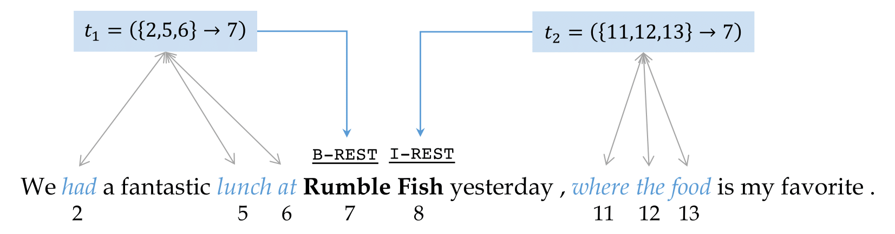

# TriggerNER
Code & Data for ACL 2020 paper: 

[TriggerNER: Learning with Entity Triggers as Explanations for Named Entity Recognition](https://arxiv.org/abs/2004.07493)

Authors: [Bill Yuchen Lin&ast;](https://yuchenlin.xyz), [Dong-Ho Lee&ast;](https://danny-lee.info/), Ming Shen, [Ryan Moreno](https://ryan-moreno.github.io/), Xiao Huang, [Prashant Shiralkar](https://sites.google.com/site/shiralkarprashant/), [Xiang Ren](http://ink-ron.usc.edu/xiangren/)


We introduce **entity triggers**, an effective proxy of human explanations for facilitating label-efficient learning of NER models. 
We crowd-sourced 14k entity triggers for two well-studied NER datasets.
Our proposed model, name Trigger Matching Network, jointly learns trigger representations and soft matching module with self-attention such that can generalize to unseen sentences easily for tagging.
Expriments show that the framework is significantly more cost-effective such that usinng 20% of the trigger-annotated sentences can result in a comparable performance of conventional supervised approaches using 70% training data.

<p align="center"></p>

If you make use of this code or the entity triggers in your work, please kindly cite the following paper:

```bibtex
@inproceedings{TriggerNER2020,
  title={TriggerNER: Learning with Entity Triggers as Explanations for Named Entity Recognition},
  author={Bill Yuchen Lin and Dong-Ho Lee and Ming Shen and Ryan Moreno and Xiao Huang  and Prashant Shiralkar and Xiang Ren}, 
  booktitle={Proceedings of ACL},
  year={2020}
}
```


## Quick Links
* [Requirements](#Requirements)
* [Trigger Dataset](#Trigger-Dataset)
* [Train and Test](#train-and-test)


## Trigger Dataset


The concept of **entity triggers**, a novel form of explanatory annotation for named entity recognition problems.  
We crowd-source and publicly release 14k annotated entity triggers on two popular datasets: 
CoNLL03 (generic domain), BC5CDR (biomedical domain).

`dataset/` saves CONLL, BC5CDR, and Laptop-Reviews dataset. For each directory, 

* `train.txt, test.txt, dev.txt` are original dataset
* `train_20.txt` is for cutting out the original train dataset into 20% for baseline setting. The dataset is used in `naive.py`
* `trigger_20.txt` is trigger dataset. The dataset is used in `supervised.py` and `semi_supervised.py`.

To enable 3% of original training dataset, you should use `--percentage 15` since the dataset we used for supervised.py and semi_supervised.py is 20% of original training data with triggers.

## Requirements
Python >= 3.6 and PyTorch >= 0.4.1
```bash
python -m pip install -r requirements.txt
```

## Train and Test
* Train/Test Baseline (Bi-LSTM / CRF with 20 % of training dataset) :
```
python naive.py --dataset CONLL
python naive.py --dataset BC5CDR
```

* Train/Test Trigger Matching Network in supervised setting :
```
python supervised.py --dataset CONLL
python supervised.py --dataset BC5CDR
```


* Train/Test Trigger Matching Network in semi-supervised setting (self-training) :
```
python semi_supervised.py --dataset CONLL
python semi_supervised.py --dataset BC5CDR
```

Our code is based on https://github.com/allanj/pytorch_lstmcrf. 


[INK Lab](http://inklab.usc.edu/) at USC
